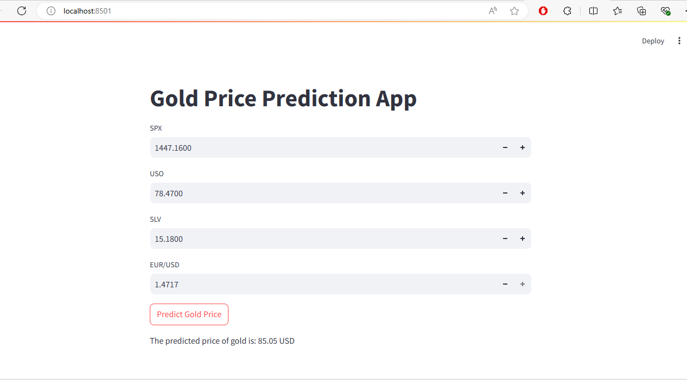

# Gold Price Prediction Model

## Overview

This project implements a machine learning model to predict the price of gold based on various financial indicators. The application provides a user-friendly interface for users to input financial data and obtain a prediction of the gold price.

## Features

- **Data Preprocessing**: Standardizes the input features for better model performance.
- **Gold Price Prediction**: Uses a Random Forest Regressor to predict the price of gold based on input features.
- **Streamlit Interface**: A simple web interface for user interaction, allowing users to input financial indicators and view the predicted gold price.

## Technologies Used

|                 |       |
|-----------------|-------|
| **Python**      |  |
| **Streamlit**   |  |
| **scikit-learn**|  |
| **Pandas**      |  |
| **NumPy**       |  |

## Output Screenshot


## Installation

To run this project, you need to install the required libraries. Run the following command:

```bash
pip install streamlit pandas numpy scikit-learn
